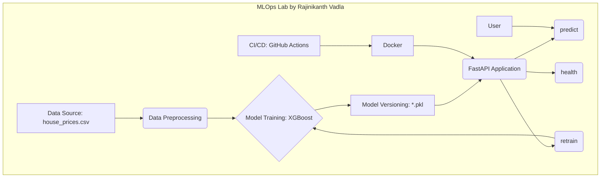

# MLOps Lab: House Price Prediction with FastAPI


This project is a real-world, production-ready MLOps lab that demonstrates an end-to-end machine learning workflow. We use a house price prediction dataset to train an XGBoost model and serve it via a FastAPI application. The entire setup is containerized with Docker and includes a basic CI/CD pipeline using GitHub Actions.

## Architectural Diagram



## Project Structure

```
.
├── .github
│   └── workflows
│       └── main.yml
├── app
│   └── main.py
├── data
│   └── house_prices.csv
├── docs
├── models
│   ├── house_price_model_v1.0.pkl
│   └── model_columns.pkl
├── scripts
│   └── train.py
├── .dockerignore
├── Dockerfile
├── README.md
└── requirements.txt
```

## One-Click Run Instructions

### Prerequisites
- Docker installed
- Git installed

### Running Locally

1. **Clone the repository:**
   ```bash
   git clone <repository-url>
   cd <repository-name>
   ```

2. **Build and run the Docker container:**
   ```bash
   docker build -t house-price-predictor .
   docker run -p 80:80 house-price-predictor
   ```

3. **Access the API:**
   - **Health Check:** [http://localhost/health](http://localhost/health)
   - **API Docs:** [http://localhost/docs](http://localhost/docs)

## Detailed Documentation

For more detailed, student-friendly explanations of each step, please refer to the documents in the `docs/` folder. (These will be created in the next steps).

